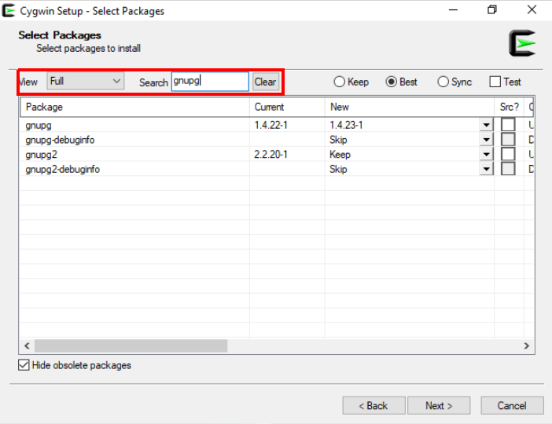

# Practical exercise on data ingestion

In this practical, you will perform multiple steps needed on data ingestion and working environment setup. You will download the test dataset, verify its integrity and add minimal documentation. Finally, you will have data stored in optimal way for subsequent (re-)use in your future research projects.

## Requirements

Participants are required to have running instance of Linux command line with basic user rights.

#### Using Cygwin

You can use [Cygwin](https://www.cygwin.com/). Please select packages **gnupg** and **tree** to be installed.



#### Using Virtual Box

You can follow instructions for the installation of Virtual Box available in the learning material of our session on reproducible analyses:

https://git-r3lab.uni.lu/R3/school/snakemake-tutorial/-/blob/master/virtualbox.md


## Step 1: Ingestion folder

* Create your ingestion folder and change your working directory

  ```bash
  mkdir test-data
  cd test-data
  ```


## Step 2: Data download

* Use following command to download the data from WebDAV server

  ```bash
  curl https://webdav-r3lab.uni.lu/public/biocore/snakemake_tutorial/snakemake_tutorial_data.tar.gz.gpg -o snakemake_tutorial_data.tar.gz.gpg
  ```

## Step 3: Checksums

Your collaborator/data provider has generated checksums - digital signatures of the file - when posting the data on your shared storage. These are commonly saved in plain text file placed close to the actual data.

In our test scenario, `md5sum` tool was used for checksum generation.

* Download checksums

  ```bash
  curl https://webdav-r3lab.uni.lu/public/biocore/snakemake_tutorial/snakemake_tutorial_data.tar.gz.gpg.md5 -o snakemake_tutorial_data.tar.gz.gpg.md5
  ```

* Inspect file with checksums

  ```bash
  cat snakemake_tutorial_data.tar.gz.gpg.md5
  ```

### Verify checksums

Data might have been corrupted already on the server or during the transfer. This step ensures that the data are exactly the same as at the time of last generation of checksums.

* Verify checksums

  ```bash
  md5sum -c snakemake_tutorial_data.tar.gz.gpg.md5
  ```

## Step 4: Decrypt and extract data

The data are encrypted for high security measures. The passkey or passphrase for decryption is `elixirLU`. In real situations the passphrase should always be transmitted in a secure way and separate from the data!

* Decrypt the data with `gpg` tool and finally unpack it.

  ```bash
  gpg -o snakemake_tutorial_data.tar.gz --decrypt snakemake_tutorial_data.tar.gz.gpg
  tar -xzf snakemake_tutorial_data.tar.gz
  ```

## Step 5: Create a README file

Write minimal information about the folder and data you have just downloaded.

The README file should be in plain format (TXT, Markdown) and contain following information: dataset name/title, date of creation/download, data origin, version of the data, data owner/responsible, data structure, how was the data downloaded, ...

* Use following commands to create a README file and enter the editor

  ```bash
  touch README.md
  vi README.md
  ```

(Press key "i" to start typing. To save and exit - hit "Esc", type ":wq" and hit "Enter")

## Step 6: Make data read-only

To ensure that nobody will be tempering with the single original copy of the data, it is a best practice to make it read-only.

* Navigate back to the parent directory and use `chmod` - GNU coreutils tool for changing the mode of the files and directories to be read-only

  ```bash
  cd ..
  chmod -R a-w test-data
  ```

## Step 7: Create symbolic link

Research data are commonly large and making copies of the same dataset makes it hard to manage. It is particularly much harder to keep track of all versions/copies of the data. Moreover, redundant copies occupy unnecessary disk space both on actual storage and on backup storage.

* Create folder for your first analyses including folder for data

  ```bash
  mkdir -p my-test-analyses/data
  ```

* create symbolic link from your analyses folder to your data folder

  ```bash
  ln -s ../../test-data my-test-analyses/data
  ```

## Step 8: Inspect your setup

* Get an overview of all folders and files in your directory.

  ```bash
  tree -p
  ```

Notice your symbolic link and read only permissions set on files in data folder.
