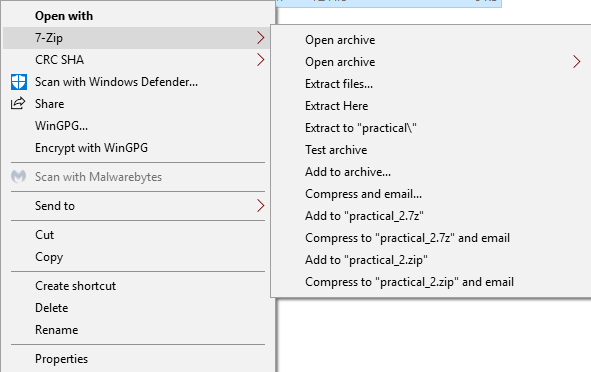
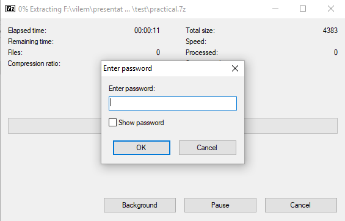
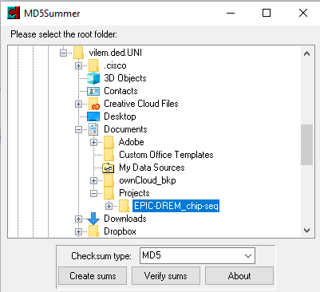
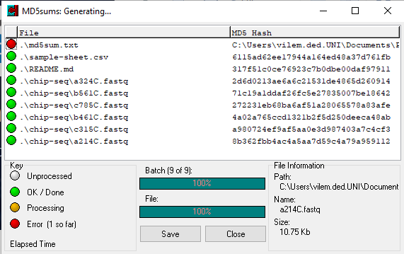

# Practical exercise on data ingestion

In this practical, you will perform multiple steps needed on data ingestion and working environment setup. You will download the test dataset, verify its integrity and add minimal documentation. Finally, you will have data stored in optimal way for subsequent (re-)use in your future steps.

## Requirements

Participants are required to have several tools installed before the practical. These will allow them to work with `.7z` archives and verify MD5 checksums. Follow the link according to your platform:

* [Windows](./requirements/windows.md)
* [Mac](./requirements/mac.md)
* [Linux](./requirements/linux.md)

## Step 1: Register the data in your local data catalogue

Registering the data is necessary for compliance with GDPR. The record should also contain information on actual physical location of the data which should be known before actual ingestion.

## Step 2: Receive data and decryption password

Please, read the [email](./data/email-with-data-link.rtf) from your collaborator with download link and password link.

* Download the data
* Get encryption password

## Step 3: Decrypt and extract the data

### Windows

1. Right-click on the archive file
2. Select 7zip -> Extract here
3. Enter the encryption password




### Mac

1. Double-click on the archive file
2. Enter the encryption password

   

### Linux

Use `7z` command line tool to extract the archive.
  ```bash
  7z x EPIC-DREM_chip-seq.7z
  # Enter the ecryption password
  ```

## Step 4: Checksums

Your collaborator/data provider has generated checksums before uploading the data on your shared storage. These are commonly saved in plain text file and placed close to the actual data.

In our test scenario, `md5sum` tool was used for checksum generation.

* Download checksums:

  https://dropit.uni.lu/invitations?share=27c80a6f57748d13e9c6&dl=0

* Open the downloaded file with your favorite text editor and inspect the content

### Verify checksums

Data might have been corrupted already on the server or during the transfer. This step ensures that the data are exactly the same as at the time of the last checksum computation.

#### Windows

1. Put the `checksums.md5` file in your dataset directory
2. Install `md5summer` tool (see [instructions](../requirements/windows.md))
3. Run `md5summer.exe`
4. Choose the root folder to be the folder of the dataset

   

5. Ensure the `MD5` algorithm is selected
6. Click `Verify sums` and select the `checksums.md5` file
7. Inspect the result

    

#### Mac
1. Install and run `Checksum` tool (see [instructions](../requirements/windows.md))
2. Choose MD5 algorithm
3. Drag and drop the file archive into `Checksum` window
4. Compare the result with the checksum provided by your collaborator by pasting in into the 

#### Linux
Place the file with checksums next to the file archive and run following command:
  
  ```bash
  md5sum -c EPIC-DREM_chip-seq.7z.md5
  ```

## Step 5: Create a README file

Write minimal information about the folder and data you have just downloaded.

The README file should be in plain format (TXT, Markdown) and contain following information:
  
  * dataset name/title
  * project name
  * date of creation/download
  * data origin
  * version of the data
  * data owner/responsible
  * data structure
  * how was the data downloaded/received
  * ...

## Step 6: Make data read-only

To ensure that nobody will be tempering with the single original copy of the data, it is a best practice to make it read-only.

#### Windows
  1. Right-click on the folder
  2. Select `Properties`
  3. In `Attributes` section, check the `Read-only` checkbox
  4. Click on `Apply` button and confirm
   
#### Mac
TODO:
#### Linux
Navigate the parent directory and use `chmod` - GNU coreutils tool for changing the mode of the files and directories to be read-only

  ```bash
  cd ..
  chmod -R a-w test-data
  ```

#### Create a new version of your dataset
TODO:
1. create new folder with proper file name (include suffix with version or date)
2. place new data into the folder
3. Add CHANGE.log describing the change

### Final Assingment
Your task will be to update the dataset and sent it to the trainer. To follow best practices, you should:
1. Prepare data for transfer
   1. include README file for recipient
   2. generate checksums
   3. create an encrypted archive
2. Send the data, checksums and encryption password securely
