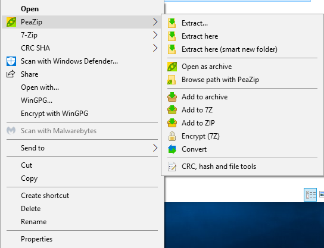

# Practical exercise on data ingestion

In this practical, you will perform multiple steps needed on data ingestion and working environment setup. You will download the test dataset, verify its integrity and add minimal documentation. Finally, you will have data stored in optimal way for subsequent (re-)use in your future steps.

## Requirements

Participants are required to have several tools installed before the practical. These will allow them to work with `.7z` archives and verify MD5 checksums. Follow the link according to your platform:

* [Windows](./requirements/windows.md)
* [Mac](./requirements/mac.md)
* [Linux](./requirements/linux.md)

## Step 1: Register the data in your local data catalogue

Registering the data is necessary for compliance with GDPR. The record should also contain information on actual physical location of the data which should be known before actual ingestion.

## Step 2: Receive data and decryption password

Please, read the [email](./data/email-with-data-link.md) from your collaborator with download link and password link.

* Download the data
* Get encryption password

## Step 3: Checksums

Your collaborator/data provider has generated checksums before uploading the data on your shared storage. These are commonly saved in plain text file and placed close to the actual data.

In our test scenario, `md5sum` tool was used for checksum generation.

* Open the downloaded checksum file (`EPIC-DREM_chip-seq.7z.md5`) with your favorite text editor and inspect the content

### Verify checksums

Data might have been corrupted already on the server or during the transfer. This step ensures that the data are exactly the same as at the time of the last checksum computation.

#### Windows

1. Install `PeaZip` tool (see [instructions](../requirements/windows.md))
2. Right-click on a file -> PeaZip -> `CRC, has and file tools`

   

3. Hit `OK`

   

4. Go to `Clipboard` and verify the MD5 checksum string is matching the one in provided checksum file.

    

#### Mac with GUI

1. Install and run `Checksum` tool (see [instructions](../requirements/mac.md))
2. Choose MD5 algorithm
3. Drag and drop the file archive into `Checksum` window

   

4. Compare the result with the provided checksum by pasting it into `Paste reported checksum here` field. 

#### Linux
Place the file with checksums next to the file archive and run following command:
  
  ```bash
  md5sum -c EPIC-DREM_chip-seq.7z.md5
  ```

## Step 4: Decrypt and extract the data

### Windows

1. Right-click on the archive file
2. Select `PeaZip` -> Extract here
3. Enter the encryption password


### Mac with GUI

1. Right-click on the file archive and select "Open with" -> KEKA

   

2. Enter the encryption password

### Linux

Use `7z` command line tool to extract the archive.

  ```bash
  7z x EPIC-DREM_chip-seq.7z
  # Enter the ecryption password
  ```

## Step 5: Create a README file

Write minimal information about the folder and data you have just downloaded.

The README file should be in plain format (TXT, Markdown) and contain following information:
  
  * dataset name/title
  * project name
  * date of creation/download
  * data origin
  * version of the data
  * data owner/responsible
  * data structure
  * how was the data downloaded/received
  * ...

## Step 6: Make data read-only

To ensure that nobody will be tempering with the single original copy of the data, it is a best practice to make it read-only.

#### Windows

  1. Right-click on the folder
  2. Select `Properties`
  3. In `Attributes` section, check the `Read-only` checkbox
  4. Click on `Apply` button and confirm

#### Mac with GUI

1. Right-click on the folder/file and select "Get Info"
2. Expand the section `Sharing & Permissions`
3. If the small lock icon at the bottom is locked, click on it to unlock it.
4. Set Priviledge to `Read only` for all users/user groups.
5. Use bottom dropdown icon to apply changes to all enclosed items

    

#### Linux
Navigate the parent directory and use `chmod` - GNU coreutils tool for changing the mode of the files and directories to be read-only

  ```bash
  cd ..
  chmod -R a-w test-data
  ```

<!-- ## Step 7: Create a new version of your dataset

1. create new folder with proper file name (include suffix with version or date)
2. place new data into the folder
3. Add CHANGE.log describing the change -->

### Final Assingment

Your task will be to update the dataset and sent it to the trainer. To follow best practices, you should:
1. Prepare data for transfer
   1. include README file for recipient in the folder
   2. create an encrypted archive
   3. generate checksums
2. Send the data, checksums and encryption password securely. Remember to use secure channels designed for data transfer.

#### Windows

1. Right-click on the folder and select `PeaZip` -> Add to archive

    

2. Select archive name and format. Click on `Enter password / keyfile` and enter your encryption phrase.
  
    

3. For checksum computation you can use the same steps as in the section [Verify checksums](#verify-checksums)

4. Save the checksum in a file with the same name + `.md5` suffix

#### Mac with GUI

1. Open KEKA tool

    

2. Choose the type of your archive and enter encryption password
3. Drag and drop the folder into the window
4. Hit OK
5. For checksum generation open the `Checksum` tool and drag and drop the file archive

#### Linux

Create an archive:

  ```bash
  7z a <name-of-the-archive>.7z <folder-to-be-archived> -p
  # enter the encryption password
  ```
  
Genereate checksum file for the archive:

  ```bash
  md5sum <name-of-the-archive>.7z > checksums.md5
  ```
