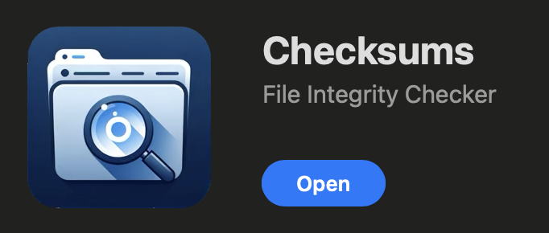

# Requirements for Mac OS users

## With GUI

### KEKA

**KEKA** is widely used archiving tool. It is free if downloaded directly from their [website](https://www.keka.io/en/).
### Checksum

`Checksum` is simple free tool for checksum computation available directly from Apple App Store.



## Without GUI

If you install following tools please refer to the solutions for Linux based systems in the practical.
### Working with file archives

Install the tool `7-zip` using brew:

```bash
brew install p7zip
```

### Verifying checksums

Install the tool `md5sum` using brew:

```bash
brew install md5sha1sum
```
